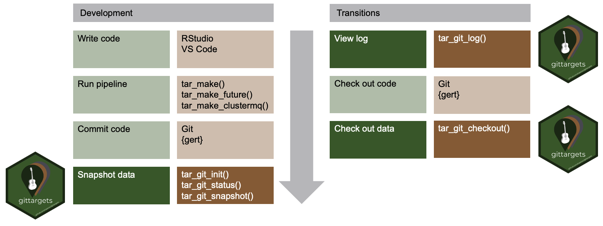

# gittargets 

[](https://CRAN.R-project.org/package=gittargets)
[](https://www.repostatus.org/#wip)
[](https://github.com/wlandau/gittargets/actions?query=workflow%3Acheck)
[](https://codecov.io/gh/wlandau/gittargets)
[](https://github.com/wlandau/gittargets/actions?query=workflow%3Alint)

Version control systems such as Git help researchers track changes and
history in data science projects, and the
[`targets`](https://docs.ropensci.org/targets/) package minimizes the
computational cost of keeping the latest results reproducible and up to
date. The `gittargets` package combines these two capabilities. The
[`targets`](https://docs.ropensci.org/targets/) data store becomes a
version control repository and stays synchronized with the Git
repository of the source code. Users can switch commits and branches
without invalidating the [`targets`](https://docs.ropensci.org/targets/)
pipeline.

## Prerequisites

1.  Familiarity with the [R programming
    language](https://www.r-project.org/), covered in [R for Data
    Science](https://r4ds.had.co.nz/).
2.  [Data science workflow management best
    practices](https://rstats.wtf/index.html).
3.  [Git](https://git-scm.com), covered in [Happy Git and GitHub for the
    useR](https://happygitwithr.com).
4.  [`targets`](https://docs.ropensci.org/targets/), which has resources
    on the [documentation
    website](https://docs.ropensci.org/targets/#how-to-get-started).

## Installation

Install the development version from R with:

``` r
install.packages("remotes")
remotes::install_github("wlandau/gittargets")
```

You will also need command line Git, available at
<https://git-scm.com/downloads>.[1] Please make sure Git is reachable
from your system path environment variables. To control which Git
executable `gittargets` uses, you may set the `TAR_GIT` environment
variable with `usethis::edit_r_environ()` or `Sys.setenv()`. You will
also need to configure your user name and user email at the global level
using the instructions at
<https://git-scm.com/book/en/v2/Getting-Started-First-Time-Git-Setup>
(or `gert::git_config_global_set()`). Run `tar_git_ok()` to check
installation and configuration.

``` r
tar_git_ok()
#> ✓ Git binary: /path/to/git
#> ✓ Git config global user name: your_user_name
#> ✓ Git config global user email: your_email@example.com
#> [1] TRUE
```

There are also backend-specific installation requirements and
recommendations in the [package
vignettes](https://wlandau.github.io/gittargets/articles/index.html).

## How it works



### Development

When you develop a reproducible analysis project, you write R code, run
the pipeline, commit the code to a branch, and repeat. `gittargets`
enters the picture at the end of each one of these development cycles.
When the code files are up to date in the Git repository and the targets
are up to date in the pipeline, `gittargets` can snapshot the [`targets`
data
store](https://books.ropensci.org/targets/files.html#internal-data-files)
to a local version control repository of its own. Data snapshots map to
code commits in a way that facilitates data recovery. This mapping may
differ from backend to backend, and the [package
vignettes](https://wlandau.github.io/gittargets/articles/index.html)
explain the details.

### Transitions

To reproducibly track alternative versions of your project, it is good
practice to create multiple Git commits and Git branches for your R code
during development. That way, you can transition among multiple versions
of your code with
[`git checkout`](https://git-scm.com/docs/git-checkout). But your code
commits probably do not contain the [`targets` data
store](https://books.ropensci.org/targets/files.html#internal-data-files)
because it is too big to fit on [GitHub](https://github.com). If so,
switching to a different branch will most likely invalidate the
[`targets`](https://docs.ropensci.org/targets/) pipeline, causing you to
rerun hours of computation you should not have to run. But with
`gittargets`, once you check out a branch in the code, you can also
check out the corresponding snapshot of the [data
store](https://books.ropensci.org/targets/files.html#internal-data-files).
If you check out both the code commit and its matching data snapshot,
then you will restore your old targets and they will all be up to date.

### Performance

`targets` generates a large amount of data in `_targets/objects/`, so
data snapshots and checkouts may take a long time. To work around
performance limitations, you may wish to only snapshot the data at the
most important milestones of your project. Please refer to the [package
vignettes](https://wlandau.github.io/gittargets/articles/index.html) for
specific recommendations on optimizing performance.

## Future directions

The first data versioning system in `gittargets` uses
[Git](https://git-scm.com), which is designed for source code and may
not scale to enormous amounts of compressed data. Future releases of
`gittargets` may explore other potential data backends such as
[`git-annex`](https://git-annex.branchable.com) and
[DVC](https://dvc.org).

## Code of Conduct

Please note that the `gittargets` project is released with a
[Contributor Code of
Conduct](https://contributor-covenant.org/version/2/0/CODE_OF_CONDUCT.html).
By contributing to this project, you agree to abide by its terms.

## Citation

``` r
citation("gittargets")
#> 
#> To cite package 'gittargets' in publications use:
#> 
#>   William Michael Landau (NA). gittargets: Version Control for the
#>   Targets Package. https://wlandau.github.io/gittargets/,
#>   https://github.com/wlandau/gittargets.
#> 
#> A BibTeX entry for LaTeX users is
#> 
#>   @Manual{,
#>     title = {gittargets: Version Control for the Targets Package},
#>     author = {William Michael Landau},
#>     note = {https://wlandau.github.io/gittargets/, https://github.com/wlandau/gittargets},
#>   }
```

[1] `gert` does not have these requirements, but `gittargets` does not
exclusively rely on `gert` because `libgit2` does not automatically work
with `git-lfs`.
